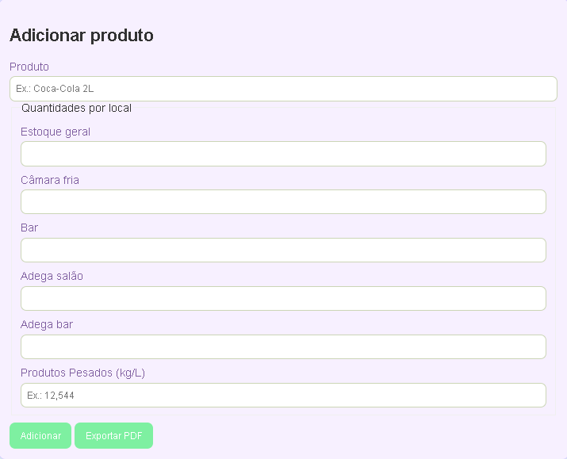
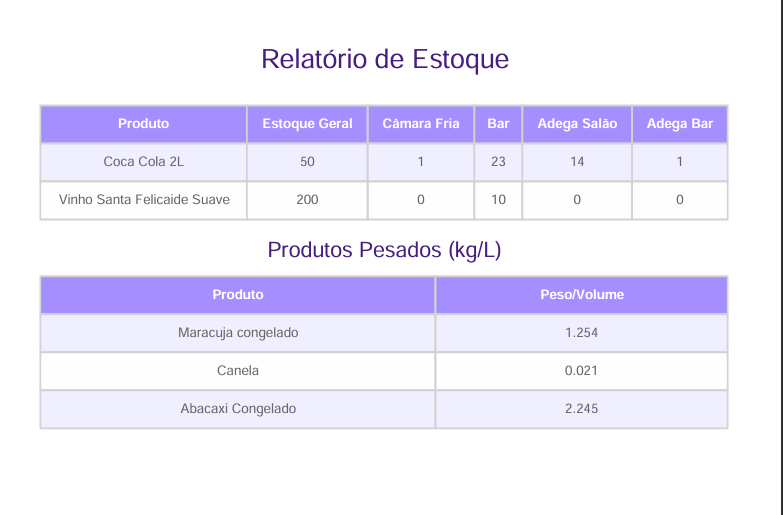

# 🍕 Sistema de Controle de Estoque - Pizzaria

Este é um sistema simples de **controle de estoque** desenvolvido para facilitar o balanço mensal da pizzaria onde trabalho.  
O objetivo foi substituir o uso de **papel e caneta** por uma solução digital mais prática, rápida e confiável.

---

## Contexto

No meu trabalho atual, todo mês fazemos o balanço de produtos utilizando folhas de papel.  
Isso gerava alguns problemas:  
- Rasuras e correções deixavam o balanço desorganizado  
- Risco de molhar ou perder as folhas  
- Dificuldade em manter o histórico de balanços  

Como estou estudando **Análise e Desenvolvimento de Sistemas (ADS)** e quero atuar como programador, decidi criar esse sistema para resolver o problema.

---

## ⚙️ Funcionalidades

✔️ Cadastro de produtos e separação por setor (bar, câmara fria, estoque geral, etc.)  
✔️ Registro de quantidades com suporte a números decimais  
✔️ Salvamento automático usando **localStorage** (não perde os dados ao fechar o navegador)  
✔️ Exportação em **PDF** para compartilhar com a gerência  
✔️ Interface simples e responsiva (funciona em celular, tablet ou computador)  

---

##  Como usar

1. Acesse a página no navegador (funciona no PC, tablet e celular).  
2. Preencha as quantidades de cada produto por setor.  
3. Clique em **Exportar PDF** para gerar o balanço pronto para envio.  

---

##  Demonstração

## 🌐 Acesse o sistema
👉 [Clique aqui para usar](https://sailorjupiter.github.io/balanco-mensal/)

---

## Tecnologias utilizadas

- **HTML5**  
- **CSS3**  
- **JavaScript (ES6)**  
- **localStorage** para armazenamento local  
- **jsPDF** para exportação em PDF  

---

##  Próximos passos

- [ ] Criar uma tela inicial com opções de setor (Bar, Produção, Embalagens, etc.)  
- [ ] Adicionar histórico de balanços  
- [ ] Criar login simples com PIN  
- [ ] Deploy no **GitHub Pages** para facilitar acesso em qualquer dispositivo  

---

##  Autor

Desenvolvido por **Pedro Luiz** — estudante de **ADS** 

Se quiser trocar ideia ou colaborar, me chama aqui no GitHub! 🚀

